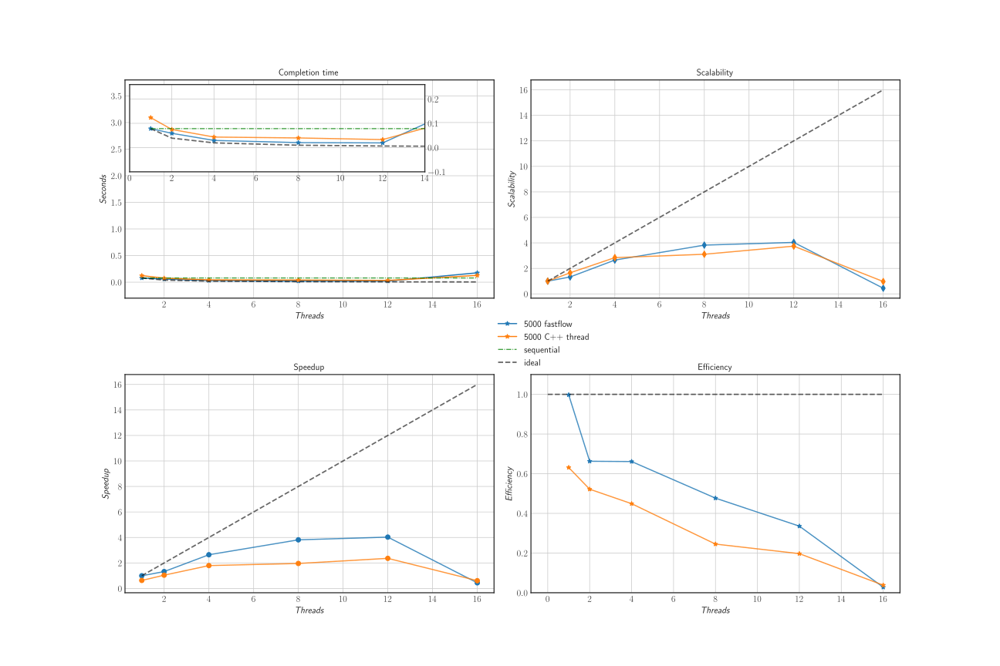
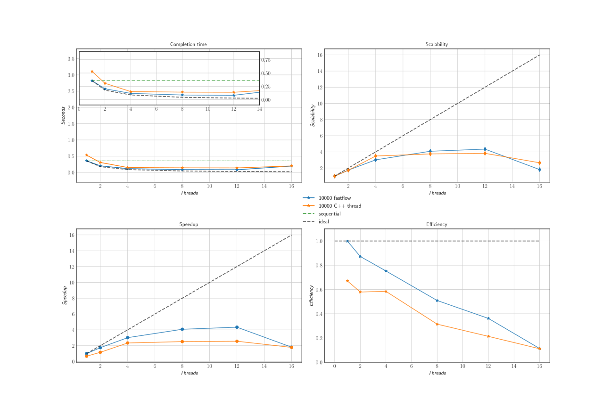
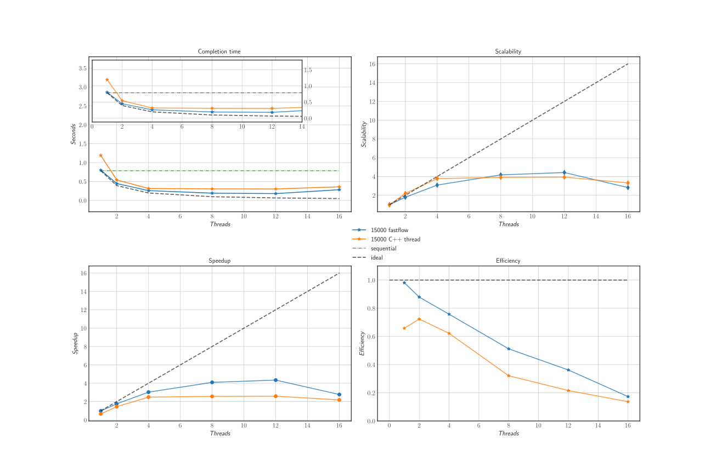
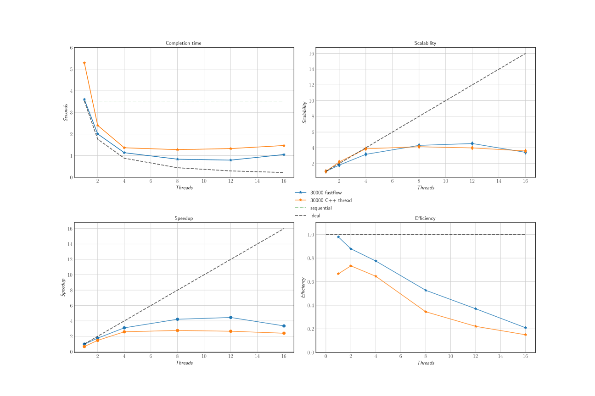

# Jacobi-iterative-method

## Introduction

The aim of this project was to compare different implementation of the Jacobi iterative method to solve linear systems. Two different approaches have been followed:
- sequential approach
- parallel approach, the algorithm has been parallelized
    - using C++11 threads (distributing the work among different threads),
    - **FastFlow** framework (using the parallel_for pattern)
    - **Cuda** framework
 
All the experiments have been executed on two different machines (the second machine, equipped with a GPU device, was useful to allow tests for Cuda framework):
- one using an Intel Xeon E2650 CPU (8 cores clocked at 2 GHz each with 2 contexts 2-way hyperthreads) and an Intel Xeon Phi co-processor (60 cores clocked at 1 GHz each with 4 contexts 4-way hyperthreads);
- one using an AMD OpteronTM Processor 6176 (12 cores clocked at 2.3 GHz with 2 contexts).
For each experiment (i.e. for each approach, listed above, and for different linear system sizes) the completion time have been collected. Furthermore, for all the parallel versions, speedup, scalability and efficiency have been computed.

## Implementation
The implementation consists in four different variants of the Jacobi iterative method (sequential, threads, FastFlow and Cuda).
The source code is organized as follows:
- The main function, in file main.cpp, implements the input parameter parsing and the gen- eration and initialization of data.
- The class **JacobiData**, in file _jacobi\_data.hpp_, collects all data (for analysis) about the execution of the algorithm.
- The class **JacobiSolver** implements, together with sub-classes **JacobiSeqSolver**, **JacobiFFSolver**, and **JacobiThreadSolver** a template method pattern. Each of the subclasses implements two methods: computation and iteration, specifying how the new approximation of the solution is computed. More precisely, iteration method implements Jacobi method core, computation method calls iteration inside a while loop until the convergence is reached. The division of the two methods has been useful for the parallel implementation with C++11 threads, because in this case computation method acts as emittor and collector, so it spawns threads and waits for results. The iteration method, instead, is the computation executed by each worker (each one with its piece of matrix); the entire computation, including the while loop, happens in this method.

### Sequential implementation
Class **JacobiSeqSolver**, in file _jacobi\_seq\_solver.hpp_, implements iteration method. Note that the code of iteration method has been made vectorizable using the feedback provided by the compiler. The if construct in the inner-loop (row 6 in Algorithm 1) have been removed and the loop have been split in two parts, i.e. the first part in range [0, i) and the second [i + 1, n) (where n is the matrix size in the sequential implementation, it is the number of rows of the sub-matrix in the parallel implementations).

### Analysis and results
Experiments were performed using the script **test.sh**. It runs the sequential, C++11 threads and FastFlow version both on the Xeon CPU and Xeon Phi co-processor and AMD OpteronTM Processor 6176. It also tuns the Cuda version on the AMD machine.
The range of the number of threads, for parallel versions, varies depending on the architecture (according to the details given in Section 1):
- Xeon CPU - number of threads ranges from 1 to 16;
- Xeon Phi co-processor - number of threads number ranges from 1 to 240; 
- AMD processor - number of threads ranges from 1 to 24.
The matrix order (N), instead, assume always the following values: 5000, 10000, 15000, 25000 and, apart from Cuda, 30000. Bigger matrix order fill the memory of the co-processor. All tests of FastFlow implementation use a fixed grain size of 10. The precision chosen for Xeon machine is 10−6. On AMD this precision implied a lot of iterations to converge (beacuse of different architecture and compilation), in this case, 10−5 is the precision adopted for tests.
 
Tests have been repeated twenty times for each matrix size (in parallel versions also for each number of threads in range). The completion time has been obtained by making the arithmetic mean of the values, eliminating the greatest value collected (in this way, in Cuda implementa- tion the time spent to initialize the runtime is not considered for benchmarks and for the other implementations eventually unexpected behaviours are deleted).

### Test executed on Xeon CPU
Figures show a comparison between FastFlow and C++11 threads implemen- tation on Xeon CPU.

